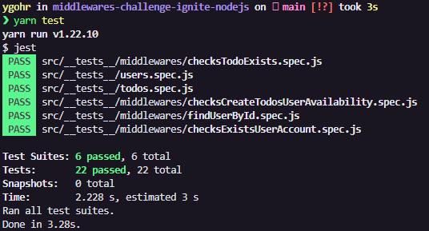

# ⚔️ Ignite - Desafio 2: Middlewares

<br>

## :pushpin: Sobre o Desafio
Este desafio tem como objetivo o desenvolvimento de uma aplicação gerenciadora de **Tarefas** (_To-dos_), associadas a um **usuário**. Além disso, reforça o uso de middlewares como uma poderosa ferramenta de validação, criando uma aplicação com mais facilidade e eficiência. A aplicação utilizada como base encontra-se neste [**repositório**](https://github.com/Ygohr/todo-challenge-ignite-nodejs). <br/>
Como uma nova propriedade do usuário, dessa vez teremos um plano grátis onde o usuário só pode criar até **dez** tarefas e um **plano Pro** que irá permitir criar todos ilimitados, isso tudo usando middlewares para fazer as validações necessárias.
As funcionalidades presentes são:
- Criar uma nova tarefa
- Listar todas as tarefas
- Alterar o título e prazo de uma tarefa existente
- Marcar uma tarefa como feita
- Excluir uma tarefa

O _template_ de arquivos utilizado neste projeto pode ser acessado em: [**template.**](https://github.com/rocketseat-education/ignite-template-trabalhando-com-middlewares)

## 📋 Requisitos e Regras de Negócio
O documento de referência de Requisitos e Regras de Negócio pode ser acessado através deste [**link.**](https://www.notion.so/Requisitos-e-Regras-de-Neg-cio-Middlewares-Desafio-2-Ignite-fb79d77b605b4f0b82fb8b1a96712fb3)

## 💻 Instalação, Dependências e Executando o Projeto
**1.** Clone este repositório 
```
git clone https://github.com/Ygohr/middlewares-challenge-ignite-nodejs
``` 
**2.** Vá até o diretório raiz do projeto
```
cd middlewares-challenge-ignite-nodejs
``` 
**3.** Instale as dependências necessárias
```
yarn 
ou
npm install
```
**4.** Execute a aplicação
```
yarn dev
```

## :floppy_disk: Usando a Aplicação
Para realização de **requisições** na aplicação, deve ser utilizado o **Insomnia** ou **Postman**, importando o [arquivo](insomnia_requests) de requisições já existente neste diretório.
Atentar-se aos parâmetros necessários no **Header**.

## :syringe: Evidência de Testes
Nesta aplicação, são contemplados **Testes Unitários**, visando garantir o correto funcionamento das funcionalidades e manter a aplicação de acordo com os requisitos. <br/>



- **Desenvolvido** **por** [**Ygohr**](https://www.linkedin.com/in/ygohr-medeiros-28451b14a/) 🤖
